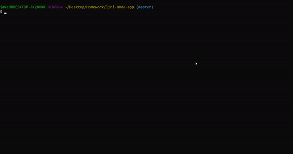
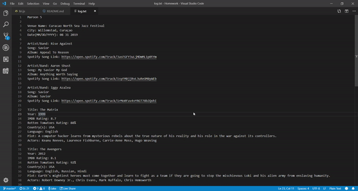
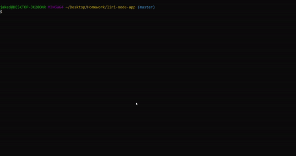

# liri-node-app

This program is a simple liri-bot used to search for concerts using [Bands in Town API](http://www.artists.bandsintown.com/bandsintown-api), songs using [Node Spotify API](https://www.npmjs.com/package/node-spotify-api), and movies using [OMDb API](http://www.omdbapi.com/). Instructions for installion can be found in this README below the demo gifs. Once launched the program asks the user what they want to do and depending upon their selection asks what the name of the concert/song/movie is they wish to search for and then uses [API's](https://en.wikipedia.org/wiki/Application_programming_interface) and [npm](https://www.npmjs.com/) packages to retrieve the desired information and display it to them with some [ASCII art](http://artii.herokuapp.com/) flare. After the information is provided the program stores the display results inside log.txt and then promts the user what they want to do next. They can then initiate another search or select the surprise option to load a song search from random.txt or select Leave in order to quit the program.

# Demo (with user input)


# Resulting Log File


# Demo (no user input---defaults)


# Link to Github
[Liri-Bot](https://github.com/JakeDudum/liri-node-app)

# How to Install (MUST HAVE GITHUB)

1. Open gitbash/terminal/console and navigate to where you would like to copy the program down to and enter the following:
```gitbash
git clone https://github.com/JakeDudum/liri-node-app.git
```
2. Next enter the following to install required npm packages:
```gitbash
npm install
```
3. Enter the following to start the program:
```gitbash
node liri.js
```
4. The following options should then appear:
```gitbash
this is loaded
? What would you like to do? (Use arrow keys)
> Search for concerts.
  Search Spotify for songs.
  Search for movies.
  Surprise me.
  Leave
```
5. Follow the instructions of the program and select desired functionality.
6. Enjoy!

# Built With
- [Javascript](https://developer.mozilla.org/en-US/docs/Web/JavaScript)
- [Node](https://nodejs.org/en/about/)
- [NPM](https://docs.npmjs.com/about-npm/)

# API's Used 
- [Bands in Town](http://www.artists.bandsintown.com/bandsintown-api)
- [Node Spotify](https://www.npmjs.com/package/node-spotify-api)
- [OMDb](http://www.omdbapi.com/)
- [ASCII art](http://artii.herokuapp.com/)

# NPM's Used
- [Axios](https://www.npmjs.com/package/axios)
- [Inquirer](https://www.npmjs.com/package/inquirer)
- [Moment](https://www.npmjs.com/package/moment)
- [Dotenv](https://www.npmjs.com/package/dotenv)
- [FS/File-System](https://www.npmjs.com/package/file-system)


# Versioning
- [Github](https://github.com/)

# Authors
### Jake Dudum